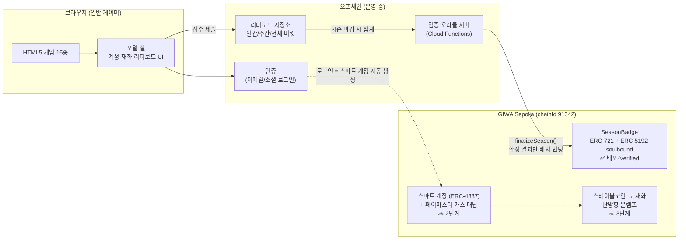

# QUARTER TURN × GIWA — 기술 아키텍처

> 웹게임 포털 [QUARTER TURN](https://fakedev.pages.dev)에 GIWA 체인 온체인 레이어를 결합하는
> 제품의 기술 원페이저입니다. GASOK 2026 · Track 05 Mass Adoption.

## 제품 한 줄

**크립토를 모르는 웹게이머에게, 자기도 모르는 사이 GIWA 지갑을 쥐여주는 게임 포털.**
설치·시드 문구·가스비 없이, 게임을 하는 것만으로 온체인 기록(시즌 랭킹 명예의 전당)과
지갑이 생기는 구조를 만듭니다.

## 시스템 구성



## 핵심 설계: 시즌 확정 오라클 패턴

온체인 기록의 전제는 **점수의 신뢰성**입니다. 클라이언트가 제출한 점수를 그대로 체인에
올리면 위·변조 점수가 영구 박제됩니다. 그래서 쓰기 경로를 단방향 파이프라인으로 강제합니다.

```
클라 점수 제출 → 서버 권위 검증·집계 (오프체인) → 시즌 마감 → 확정 결과만 온체인 커밋
```

- **민팅 권한은 오라클(컨트랙트 오너)에게만** 있습니다. 유저·클라이언트는 체인에 직접 쓸 수 없습니다.
- 시즌·게임 조합당 `finalizeSeason()` 은 **1회만 실행 가능** (이중 확정 방지가 컨트랙트에 강제됨).
- 가스비는 시즌당 배치 민팅 1회로 통제됩니다. GIWA 의 1초 블록·저가스 특성이 이 패턴에 유리합니다.

## 컨트랙트: SeasonBadge

| | |
|---|---|
| 주소 | [`0x9BCaB4D9d77aeF28E31399E95F06E3d6Ed3d8c04`](https://sepolia-explorer.giwa.io/address/0x9BCaB4D9d77aeF28E31399E95F06E3d6Ed3d8c04) (Verified) |
| 표준 | ERC-721 + ERC-5192 (Minimal Soulbound) |
| 소스 | [`contracts/SeasonBadge.sol`](./contracts/SeasonBadge.sol) |

```solidity
function finalizeSeason(
    uint64 seasonId,        // 예: 202631 = 2026년 31주차
    string calldata gameId, // 포털 게임 식별자
    address[] calldata winners, // 순위순 (winners[0] = 1위)
    uint8[] calldata tiers      // 1=gold, 2=silver, 3=bronze
) external onlyOwner;
```

- 뱃지에는 시즌·티어·최종 순위·게임 ID 가 온체인 기록됩니다.
- `_update()` 오버라이드로 **민팅 외 모든 이전(transfer)이 차단**됩니다 — 뱃지는 사고팔 수 없는
  명예의 기록입니다. ERC-5192 `locked()` 및 `Locked` 이벤트로 지갑·마켓플레이스가 잠금 상태를 인식합니다.

## 규제-호환 설계 (Regulation-Compatible by Design)

국내 게임 × 크립토의 최대 리스크인 게임산업법 환전 금지 조항을 **회피가 아니라 준수**하도록 설계했습니다.

| 설계 결정 | 효과 |
|---|---|
| 게임 재화는 오프체인 유지 — 토큰화하지 않음 | 재화의 시장 거래 가능성 원천 차단 |
| 뱃지·업적은 양도 불가(soulbound) + 무가치 | 환전·경품 조항 비해당, 치팅의 금전 유인도 제거 |
| 랭킹 보상으로 유가 토큰을 지급하지 않음 | "경쟁 → 환금 보상" P2E 루프 원천 배제 |
| 크립토 → 재화 **단방향** 온램프만 허용 | 현금화 경로 부재 — 결제 수단 추가일 뿐 P2E 아님 |

## 구현 현황과 계획

| 단계 | 항목 | 상태 |
|---|---|---|
| 0 | 포털·게임 15종·계정/재화/리더보드 | ✅ 운영 중 |
| 1 | SeasonBadge 컨트랙트 (GIWA Sepolia, Verified) | ✅ 완료 |
| 2 | 리더보드 서버 권위 검증 승격 (오라클의 전제) | 🔜 MVP |
| 2 | 시즌 확정 파이프라인 + 명예의 전당 페이지 (온체인 조회) | 🔜 MVP |
| 3 | 임베디드 지갑 — ERC-4337 스마트 계정 + 페이마스터 | 🔜 MVP~정식화 |
| 3 | 테스트넷 스테이블코인 → 재화 온램프 데모 | 🔜 정식화 |
| 4 | 외부 인디게임 입점 SDK (포털 = GIWA 온보딩 인프라) | Growth |

## 기술 스택

- **포털**: Vanilla JS + Vite, Firebase Auth / Firestore (실시간 리더보드·재화 동기화)
- **호스팅/CDN**: Cloudflare Pages — 포털과 게임 번들 전체를 엣지에서 정적 서빙.
  설치·로딩 장벽 없는 즉시 플레이가 온보딩 퍼널의 첫 단계
- **오라클/백엔드**: Firebase Cloud Functions (Node.js)
- **컨트랙트**: Solidity 0.8.28, OpenZeppelin v5, Hardhat — 이 저장소
- **체인**: GIWA Sepolia (OP Stack L2, 1s block) → 메인넷 공개 시 전환
